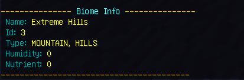
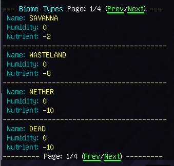
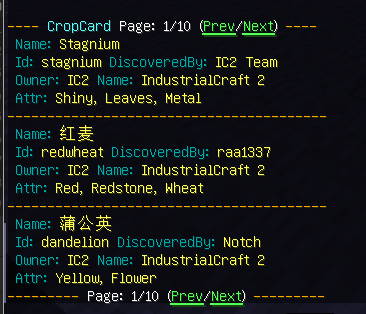

# CropChance

A mod for getting IC2 crop related information.

## Dependencies

- industrialcraft-2:2.2.828-experimental(https://jenkins.ic2.player.to/job/IC2_experimental/828/)
- UniMixins-0.1.11(https://www.curseforge.com/minecraft/mc-mods/unimixins/files/4600285)

## Usage

### Biomes info

`/crop info biome` - Show `Humidity` & `Nutrient` info of current pos.

`/crop info biomes` - Show `Humidity` & `Nutrient` info of all available biomes.

`/crop info types` - Show `Humidity` & `Nutrient` info of all available biome types.

### TickRate info

`/crop info tickrate` - Show `tickrate` of IC2 Crops.

### CropCard info

`/crop cropcard` - Show info of all available CropCards

### Cross Chance info

`/crop cross <try> <growth> <surround>` - Simulate `<try>` times, return the probability of successful
cross and the probability of weed generation.

- growth - Sets the `growth` of the parent plants;
- surround - Sets how many plants surrounds;

Note: More surround increase cross chance
Note: Different `growth` has different cross chance
Note: `resistance` > 27 will drop cross chance `5%` for every extra point

|   Growth    | Chance |
|:-----------:|:------:|
|     <16     |  20%   |
| >16 && < 30 |  25%   |
|    >=30%    |  30%   |

Note: `growth` >= 24 will consider as `weed`, may destroy other plants.

But if a plant is considered as `weed`, it won't turn into a real `weed`.

Growth = 15, Cross is about 2%

Growth = 16, Cross is about 3%

#### Growth < 16

#### Growth>=16

#### Growth>=30

