# CropChance

[EN](Readme.md)|[中文](Readme_zh.md)

用来获取IC2作物相关信息的Mod

## 依赖

- industrialcraft-2(https://www.curseforge.com/minecraft/mc-mods/industrial-craft)
- UniMixins(https://www.curseforge.com/minecraft/mc-mods/unimixins)

## 用法

### 作物加速

`/crop tick <tick count>`

用这个命令加速作物杂交、生长的进程，你也可以用它来加速杂草的扩散。

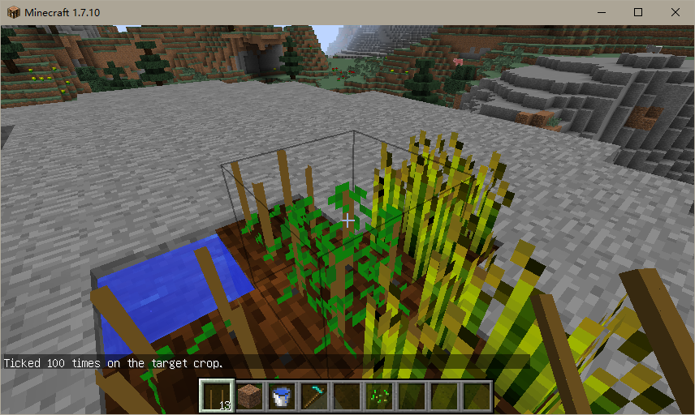

初始状态是四个小麦围着杂交架;
经过 100 tick后，杂交架产生了杂草，并扩散到了周围的作物架上。

通过查看相关的代码，我发现了一个Bug，杂草仅会向相对于它自身`z-1`或`x-1`的作物架上扩散。

```java
class TileEntityCrop {
  public void generateWeed() {
    int x = this.xCoord;
    int y = this.yCoord;
    int z = this.zCoord;
    switch (IC2.random.nextInt(4)) {
      case 0:
        ++x;
        //Missing a break here
      case 1:
        --x;
        //Missing a break here
      case 2:
        ++z;
        //Missing a break here
      case 3:
        --z;
        //Missing a break here
    }
  }
}
```

### 设置作物属性

`/crop set <growth | gain | resistance | nutrient | water | weedex | size | scan>`

使用这个命令设置作物的各项属性。

### Crop Info

`/crop show`

使用这个命令显示作物的各项属性。

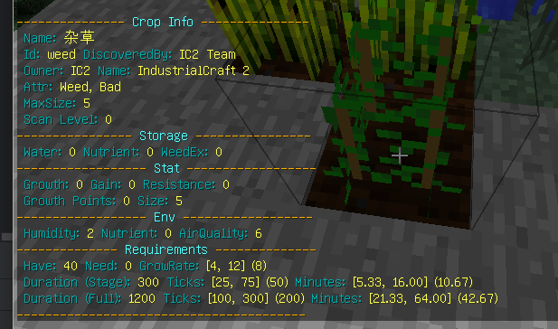

除了原本可以通过作物分析仪查看的信息，还可以查看作物的需求点数，环境提供的生长点数，以及作物的生长率，生长时间等信息。

### Biomes info

`/crop info biome`

使用这个命令查看当前生物群系的信息。

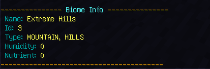

`/crop info biomes`

使用这个命令查看所有生物群系的信息。

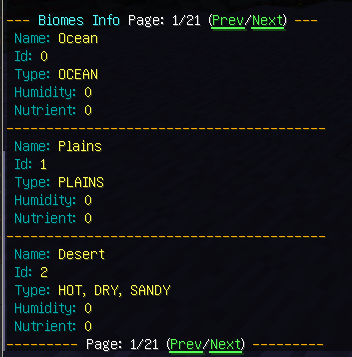

`/crop info types`

使用这个命令查看所有生物群系类型的信息。

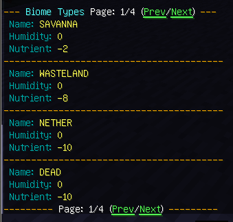

### TickRate info

`/crop info tickrate`

使用这个命令可以查看每经过多少游戏刻作物才更新一次。


### CropCard info

`/crop cropcard`

使用这个命令查看所有作物的信息。

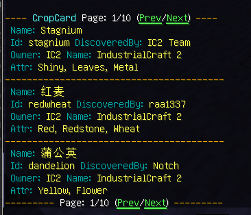

### Crop Chance

`/crop chance <try>`

使用这个命令对指向的杂交架进行杂交测试。

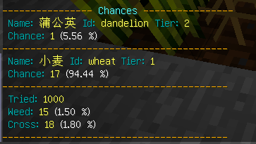

这个命令直接在当前的世界中进行模拟，返回你所指向的杂交架，其能够杂交出的产物以及几率。

### Cross Chance info

`/crop cross <try> <growth> <surround>`

使用这个命令执行杂交模拟试验。
此命令仅能分析杂交发生的概率，不能分析杂交产生哪种作物的概率。

- try - 仿真尝试的次数;
- growth - 设置父本作物的生长点数;
- surround - 设置有多少个父本作物;

父本作物的生长点数越高，其参与杂交的几率就越大；
环绕的父本作物越多，杂交发生的概率就越大。

| 生长点数 | 几率  |
|:----:|:---:|
| <16  | 20% |
| <30  | 25% |
| >=30 | 30% |

注意：当父本作物的`抗性`超过`27`点时，每超出一点，作物参与杂交几率减少`5%`.

注意: 当作物的`生长`点数>=`24`时, 它会被认为是一株杂草, 即它会在附近的作物架上产生杂草;
但是, 如果附近的作物的`生长`点数同样>=`24`时, 那么它不会被转变为真正的杂草.

生长 = 15, 杂交几率约为 2%

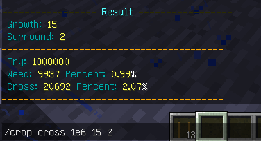

生长 = 16, 杂交几率约为 3%

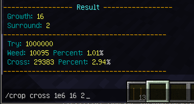

下面的折线图显示了杂交发生的概率随时间的变化曲线

图例是环绕作物的数量

生长<16

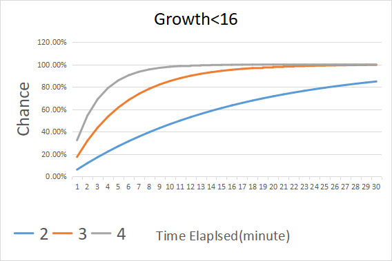

生长>=16

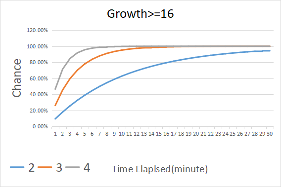

生长>=30

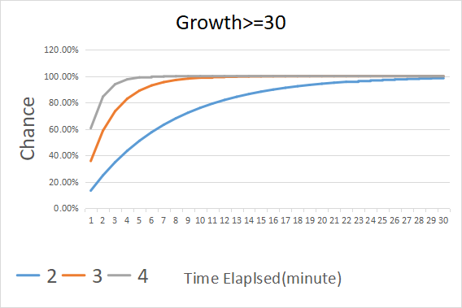
